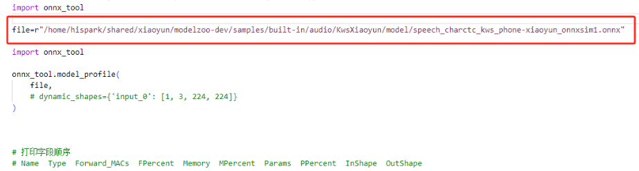
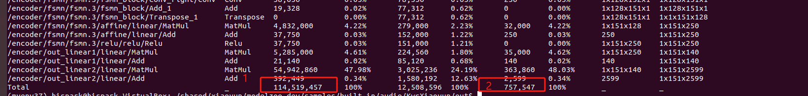
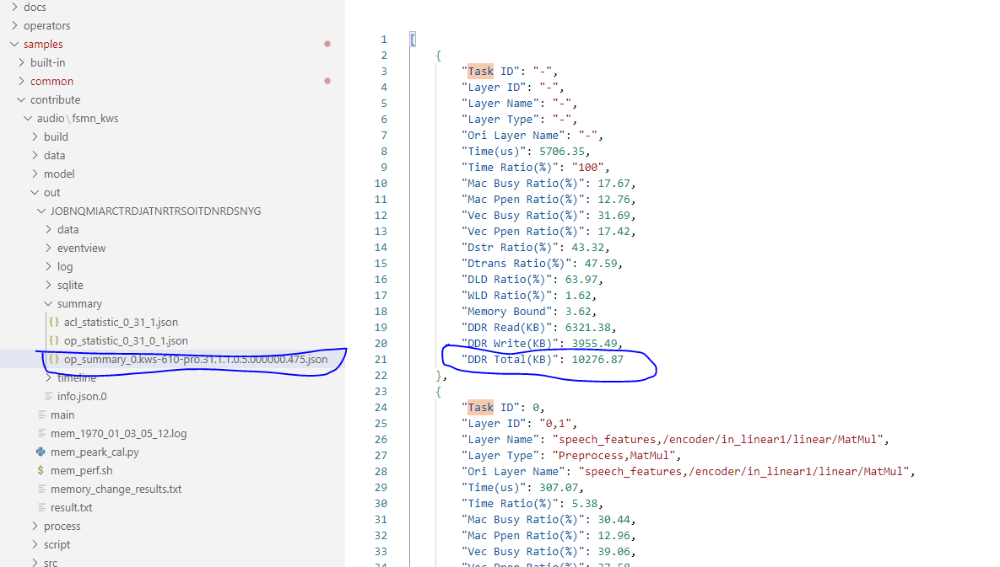

# ModelZoo贡献指导

## 1. 概述

HiSpark 社区的开源 AI 模型能力集，涵盖计算机视觉、自然语言处理、推荐、多模态、大语言模型和具身模型等类别，以及运行在海思芯片上的实操案例。

在开始贡献之前，请先阅读[社区参与贡献指南](https://gitcode.com/HiSpark/docs/blob/master/contribute/%E7%A4%BE%E5%8C%BA%E5%8F%82%E4%B8%8E%E8%B4%A1%E7%8C%AE%E6%8C%87%E5%8D%97.md)。

### 1.1 整体架构


### 1.2 目录架构

```
├── docs
│   └── ...                          // 文档说明，包含环境配置等
├── datasets                         // 数据集，包含快速开始验证数据，多个模型公用的精度验证数据集也可以放置在这里
│   ├── testdata                     // 快速开始验证数据
│   └── ...
├── samples
│   ├── built-in                     // 内部开发案例(sample开发指定目录)
    │   ├── classification           // 分类网
        │   ├── ResNet50             // 模型名称
│   ├── common                       // 多引擎推理接口差异屏蔽层，禁止修改
│   ├── contribute                   // 其他贡献案例
│   ├── opensource                   // 开源库目录
│   ├── sample_GPL                   // GPL 协议案例
│   │   ├── built-in                 // 内部开发案例
│   │   ├── common                   // 多引擎推理接口差异屏蔽层，禁止修改
│   │   ├── contribute               // 合作方贡献案例
│   │   └── opensource               // 开源库目录
│   ├── build_gate.sh                // 门禁配置，禁止修改
│   ├── build_sample.py              // 门禁配置，禁止修改
│   └── build_script.sh              // 门禁配置，禁止修改
├── utils
│   ├── generate_file_list.py        // 生成精度验证输入文件，禁止修改
│   └── preprocess.py                // 前处理文件，禁止修改
├── COPYRIGHT                        // 版权声明
├── README                           // 模型信息
├── LICENSE                          // 模型 LICENSE，禁止修改
├── OAT                              // 模型 LICENSE 整体说明
├── COPYRIGHT.OpenSource             // 三方开源引入 COPYRIGHT
└── LICENSE.OpenSource               // 三方开源引入 LICENSE
```

### 1.3 上传目录

> **请注意：** 标注为"禁止修改"的目录，其内容不允许做任何修改。
>
> 模型推理流程的上库目录请参考Resnet50，内部贡献案例在代码目录built-in目录下，其他贡献者请放在contribute目录下。

案例上传目录统一要求为： 需要在contribute目录或built-in目录/模型分类目录下创建模型目录，目录命名规则：contribute/classification/demo(存放对应开发板案例)。

## 2. 编码指导

### 2.1 推理开发

模型目录架构如下：

```
├── classification
│   └── ResNet50
│       ├── data
│       │   ├── cfg.txt                          // 模型输入配置，比如置信度阈值等
│       │   ├── file_list_1.json                 // 模型推理时数据输入（此处使用 testdata 中的图片/数据做测试）
│       ├── model_cfg
│       │   └── insert_op.cfg                    // 使用 AIPP 做前处理时的前处理参数
│       ├── model                                // 开源模型或转化后模型放置目录，不需要上传到代码仓库
│       │   ├── ResNet50.om
│       │   ├── ResNet50.pth
│       │   └── ResNet50.onnx
│       ├── out                                  // 模型运行输出、可执行文件等，不需要上传到代码仓库
│       ├── datasets                             // 数据集放置目录，不需要上传到代码仓库
│       ├── script
│       │   ├── pth2onnx.py                      // 模型转化脚本
│       │   ├── acc.py                           // 模型精度验证脚本
│       │   └── generate_file.py                 // 模型精度验证数据集输入文件的生成脚本
│       ├── process                              // 板端运行的前后处理代码
│       │   ├── pre.h                            // 前处理头文件
│       │   ├── post.h                           // 后处理头文件
│       │   ├── pre.cpp                          // 前处理实现
│       │   └── post.cpp                         // 后处理实现
│       ├── src
│       │   ├── main.cpp                         // 板端运行的入口，依据开发指导串联前后处理，实现推理
│       │   ├── acl.json                         // 推理接口依赖的配置文件，内容为 {}
│       │   └── CMakeLists.txt
│       ├── CMakeLists.txt
│       ├── LICENSE                              // 案例根目录下放置的 LICENSE 为开源模型的 LICENSE
│       ├── README.md                            // 端到端流程指导文档
│       └── requirements.txt                     // Python 脚本依赖的环境、库文件版本等，需明确标注，避免库文件升级导致测量误差
```

#### 2.1.1 代码开发

1. 模型目录结构按照 **模型目录架构** 排布。代码开发需使用 Common 模块接口，接口使用参考 **Infer 模块接口使用**。各个模型代码独立，不要相互依赖。

2. 代码风格

   请遵循编程规范进行代码开发、检视、测试，务必保持代码风格统一：

   - [C 语言编程规范](https://gitcode.com/HiSpark/docs/blob/master/contribute/C语言编程规范.md)
   - [C++ 语言编程规范](https://gitcode.com/HiSpark/docs/blob/master/contribute/C++语言编程规范.md)
   - [Python 语言编程规范](https://gitcode.com/HiSpark/docs/blob/master/contribute/Python语言编程规范.md)

3. 如果提供的案例涉及第三方开源软件，请参考[社区第三方开源软件引入指导](https://gitcode.com/HiSpark/docs/blob/master/contribute/社区第三方开源软件引入指导.md)补充相关内容，并通知华为方且通过华为方审核同意。

4. 代码使用 ModelZoo 的 copyright
关于 copyright 中的 License 声明时间，应注意：2026 年新建的文件，应该是 `Copyright (c) ModelZoo. 2026-2026. All rights reserved.` 第一个为创建年份，最后一个为修改年份。

5. 若开源模型项目已包含 License 文件，则必须拷贝引用，放置在模型的推理根目录下。若来源模型没有 License，使用项目根目录下的 License 拷贝放置在模型的推理根目录下。

6. 禁止放置恶意代码或包含安全漏洞的代码。

7. 提交的内容、图片、音频等，不得侵犯他人知识产权。

#### 2.1.2 精度性能

1. 模型精度需依据指定测试数据集完成量化验证，验证过程需明确标注数据集类型及输入图像分辨率。精度验证方式需参考同类型开源模型的官方验证流程，保证评测标准统一、验证结果具备可比性。
2. 需提供原始模型基准精度数据，精度数据优先来源于官方技术文档、论文或开源仓库公布指标。若无法获取原始模型官方精度指标，需补充编写原始模型精度测试方案及 NPU 端推理精度测试方案，明确测试流程、评测指标和判定标准。
3. 验证工具与数据输入规范

   1. **验证工具**：精度验证工具采用 Python 脚本进行开发实现，保证验证流程可自动化、可复现。
   2. **验证输入要求**：精度评测必须采用模型在开发板上的端到端推理结果，输入数据需经过完整前处理、模型推理、后处理流程。
   3. **输出结果规范**：
      - 分类网络：采用经过后处理输出的类别置信度作为验证依据；
      - 检测网络：采用后处理完成的目标检测框坐标、置信度等可视化、可人工判读结果作为验证依据；
      - 其余任务网络：统一采用人工可直观识别、业务可读的最终推理结果进行精度验证。
4. 需提供以下精度性能报告，保留三位小数。

| 序号 | 性能指标           | 单位   | 指标说明                        | 测试数值 |
| ---- | ------------------ | ------ | ------------------------------- | -------- |
| -    | 量化方式           | -      | A8W8 / A16W8                    | -        |
| -    | 分辨率             | -      | 输入图像分辨率                  | -        |
| 1    | 推理耗时           | ms     | 纯 NPU 推理耗时（不含前后处理） | -        |
| 2    | 帧率               | fps    | 每秒处理图像帧数                | -        |
| 3    | ONNX 参数量        | MB     | 原始模型权重大小                | -        |
| 4    | ONNX 计算量        | GFLOPs | 模型单次推理运算量              | -        |
| 5    | MAC 利用率         | %      | 硬件计算单元利用率              | -        |
| 6    | OM 模型大小        | MB     | NPU 编译后模型体积              | -        |
| 7    | 峰值内存           | MB     | 运行全过程最大内存占用          | -        |
| 8    | OS 峰值内存        | MB     | 系统层面峰值内存                | -        |
| 9    | MMZ 峰值内存       | MB     | 海思媒体专用内存峰值            | -        |
| 10   | 带宽占用率         | %      | 总线带宽占用比例                | -        |
| 11   | 单帧带宽           | MB     | 单帧数据读写带宽消耗            | -        |
| 12   | 前处理耗时         | ms     | 图像预处理耗时                  | -        |
| 13   | 后处理耗时         | ms     | 推理结果解析耗时                | -        |
| 14   | 原始精度（pth 等） |        |                                 |          |
| 15   | OM 测量精度        |        |                                 |          |
| 16   | 快速开始推理结果   |        |                                 |          |


#### 2.1.3 性能测量方法 

当前工具脚本放置在utils目录下，使用模型性能测试工具时，请拷贝放在 out 目录下。性能测试的输入采用readme中快速开始的输入数据，即testdata中的图片或者有版权的图片音频等。

##### 2.1.3.1 耗时、帧率、前后处理耗时

1）配置输入文件，如下：

```
{
"fileList": [
   [
   "../data/test_audio.wav"
   ]
],
"loop": 1,
"processLoop": 1
}
```

2）执行./main  --model ../model/kws-610.om --input ../data/file_list_1.json

```
[INFO] 1970-01-02 06:55:52.897 [model.cpp:359] execution time: 5.88ms, frame rate: 169.95fps
[INFO] 1970-01-02 06:55:52.898 [model.cpp:363] preprocess time: 65.43 ms
[INFO] 1970-01-02 06:55:52.898 [model.cpp:365] postprocess time: 91.86 ms
```

说明：
execution time：运行耗时
frame rate：帧率
preprocess time：前处理耗时
postprocess time：后处理耗时

##### 2.1.3.2 参数量、计算量、MAC 利用率
相关操作均在服务器端执行。
1）安装依赖
pip install onnx-tool==0.9.0
2）修改macs_cal_by_onnx_tool.py文件，指定onnx模型路径


在 out 目录下执行 python model_perf_tools/macs_cal_by_onnx_tool.py
输出结果如下：

其中1为计算量初始值，2为参数量

**计算量GFLOPs** = (Forward_MACs x 2) / 1000000000。例如：（114519457*2）/1000000000=0.229GFLOPs（保留小数点后三位）

**参数量** = Params / 1000000。例如：757547/1000000=0.758（保留小数点后三位）

**MAC 利用率** = 每秒运算量 / 算力

举例：当前 610 芯片在 A8W4 上为 1T 算力，A8W8 为 0.5T、A16W8 为 0.25T。计算公式：(GFLOPs x  fps x 100) /算力。
在A8W8情况下：（114519457x2x169.95x100）/ (0.5 x 1000000000000) = 7.7%

##### 2.1.3.3 OM 模型大小

直接在 OM 所在目录执行 `ll`，查看模型大小，单位： 0.938MB

##### 2.1.3.4 峰值内存、OS 峰值内存、MMZ 峰值内存

1）在板端执行

```
./mem_perf.sh
```

2）在服务器端执行

```
cd ../out
sudo chmod 777 -R ./
python mem_peark_cal.py mem_1970_01_03_05_12.log
```

备注：需修改相关输入文件名称和路径

##### 2.1.3.5 带宽、单帧带宽

1）带宽：将 file_list_1 中的文件 loop 修改为 1000 次以上，在板端执行

```
/bin/bspddrs > bsp.log &
./main  --model ../model/kws-610.om --input ../data/file_list_1.json
```

bsp.log中输出数据取平均值

2）单帧带宽

转化出可测试性能的 om，重点是 `online_model_type` 设置为 2：

```
atc --framework=5 --model="./model/speech_charctc_kws_phone-xiaoyun_onnxsim1.onnx" --input_type="speech_features:FP32" --output="./model/kws-610-pro" --image_list="./data/calibration/calib_batch.txt" --soc_version=Hi3516CV610 --output_type="FP16" --online_model_type="2" --compile_mode=5
```

修改acl.json内容为：

```
{ 
"profiler": {
"switch": "on", 
"output": "output",
"interval": "20",
"aic_metrics": "ArithmeticUtilization",
"aicpu": "on",
"acl_api": "on"
}
}
```

板端执行

```
./main  --model ../model/kws-610-pro.om --input ../data/file_list_1.json  --acl ../src/acl.json
```

结果

```
create file[/mnt/dev/push/one/modelzoo-dev/samples/contribute/audio/fsmn_kws/out/JOBNQMIARCTRDJATNRTRSOITDNRDSNYG/info.json.0] success!
create file[/mnt/dev/push/one/modelzoo-dev/samples/contribute/audio/fsmn_kws/out/JOBNQMIARCTRDJATNRTRSOITDNRDSNYG/data/kws-610-pro.31.net.info] success!
create file[/mnt/dev/push/one/modelzoo-dev/samples/contribute/audio/fsmn_kws/out/JOBNQMIARCTRDJATNRTRSOITDNRDSNYG/data/kws-610-pro.31.layer.info] success!
[DEBUG] 1970-01-03 08:16:16.231 [dev_interface_adapter.h:136] input tensor 0 info : dims = [1*151*400], dataType = 0,  dataSize = 32bits, dataFormat = 2, stride = 1600, size = 241600
[DEBUG] 1970-01-03 08:16:16.231 [dev_interface_adapter.h:136] input tensor 1 info : dims = [1*1*1*100], dataType = 0,  dataSize = 32bits, dataFormat = 0, stride = 400, size = 400
[DEBUG] 1970-01-03 08:16:16.231 [dev_interface_adapter.h:136] input tensor 2 info : dims = [1*1*1*201792], dataType = 0,  dataSize = 32bits, dataFormat = 0, stride = 807168, size = 807168
[DEBUG] 1970-01-03 08:16:16.231 [dev_interface_adapter.h:151] output tensor 0 info : dims = [1*151*2599], dataType = 1,  dataSize = 16bits, dataFormat = 2, stride = 5200, size = 785200
dump file[/mnt/dev/push/one/modelzoo-dev/samples/contribute/audio/fsmn_kws/out/JOBNQMIARCTRDJATNRTRSOITDNRDSNYG/data/aicore.0.1.1] net0 success!
create file[/mnt/dev/push/one/modelzoo-dev/samples/contribute/audio/fsmn_kws/out/JOBNQMIARCTRDJATNRTRSOITDNRDSNYG/data/aicore.0.kws-610-pro.31.1.1.0.done] success!
[INFO] 1970-01-03 08:16:16.418 [xiaoyun_postprocess.cpp:315] ../data/test_audio.wav
[INFO] 1970-01-03 08:16:16.419 [xiaoyun_postprocess.cpp:317] XiaoYunPostprocess: DETECTED keyword=xiaoyunxiaoyun score=0.982196
[INFO] 1970-01-03 08:16:16.419 [model.cpp:210] already infer 1 image, cost 0.18 s, 0.00% remains, 0.00min remains.
[INFO] 1970-01-03 08:16:16.422 [model.cpp:223] execution time: 5.96ms, frame rate: 167.67fps
[INFO] 1970-01-03 08:16:16.423 [model.cpp:227] preprocess time: 83.10 ms
[INFO] 1970-01-03 08:16:16.423 [model.cpp:229] postprocess time: 95.21 ms
create file[/mnt/dev/push/one/modelzoo-dev/samples/contribute/audio/fsmn_kws/out/JOBNQMIARCTRDJATNRTRSOITDNRDSNYG/data/acl_api.0.kws-610-pro.31] success!
create file[/mnt/dev/push/one/modelzoo-dev/samples/contribute/audio/fsmn_kws/out/JOBNQMIARCTRDJATNRTRSOITDNRDSNYG/data/acl_api.0.kws-610-pro.31.done] success!
```

在服务端执行：

```
sudo chmod 777 -R ./
mindcmd profile merge -d JOBNQMIARCTRDJATNRTRSOITDNRDSNYG -f json
```

查看 summary 内容：



10276.87KB 即单帧内存带宽，转化为 MB 单位：10.036MB

#### 2.1.4 文档开发

文档开发需参考示例 [README](https://gitcode.com/HiSpark/modelzoo/tree/master/samples/built-in/classification/ResNet50)，提供案例端到端复现流程。内容涵盖模型概述（模型来源和原理、输入输出数据格式）、配套环境说明、快速使用指南、原始模型与数据集下载、模型编译、单帧推理、精度及性能验证等完整环节。如果涉及 PTQ、QAT 或自研量化算法，需要详细提供可执行验证的指导。

**关键要求：**

1. 只能提供数据集的名称和官方下载地址。
2. 模型、数据集、原始模型需锁定至具体 Tag 版本，避免仓库迭代更新引入测试误差。
3. 全部操作步骤需具备可执行性与可验证性，文档整体逻辑严谨、措辞规范，无错别字及语法问题。

#### 2.1.5 代码上库

1. 目前仅允许一个主分支（master），验收通过后方可合入。开发需在本地 fork 仓库中进行，通过提交 PR 合入，不允许强制推送。

2. 案例完成后，需要在相关目录下的的build_config.json文件中添加对应的字段，字段描述及举例如下：

   ```
   {
       "buildTarget": "modelzoo-app",
       "relativePath": "audio/FastSpeech2",
       "chip": "SS928V100",
       "buildDef": "SS928V100",
       "needSmoke": "false",
       "description": "文本转语音"
   }
   ```
3. 代码提交的commit信息请填写如下内容

  ```
  【问题/需求】需求：增加yolov8s-obb 模型
  【原因分析】需求：增加yolov8s-obb 模型
  【修改描述】新增yolov8s-obb 模型，精度结果xxx，性能结果xxx
  【注意事项】不涉及
  【涉及芯片】Hi3403V100
  【自测用例】板端运行yolov8s-obb执行推理
  【自测结果】通过
  ```

  

4. 按规定配置触发门禁并满足门禁要求，具体参考[社区代码合入要求](https://gitcode.com/HiSpark/docs/blob/master/contribute/%E7%A4%BE%E5%8C%BA%E4%BB%A3%E7%A0%81%E5%90%88%E5%85%A5%E8%A6%81%E6%B1%82.md)。

#### 2.1.6 模型接入网站

代码仓库内容经过门禁且测试脚本通过后，方可走上架流程。
网站地址：https://modelzoo.hispark.hisilicon.com/#/ModelZoo

1. **效果图需清晰且可复现，效果示例的原始图片/音视频等无版权纠纷。**

2. **内容无敏感信息。**

3. 信息内容参考其他模型填写，必填项必须填写，内容准确规范。

4. 满足网站风控要求。

## 3. 自测试用例模板

| 测试用力标题 | 预置条件 | 输入 | 操作步骤 | 预期结果 | 用例执行情况 | 备注 |
| ---- | ------ | -------- | -------- | -------- | -------- | ---- |
| readMe     |  NA     |    readme     |  查看readme | readme内容和流程完整，readme需要包含模型介绍、目录、环境配置、原始模型和数据集下载、模型转化、性能和精度验证 |          |      |
| LICENSE | NA | LICENSE | 查看LICENSE | LICENSE和开源官方网站一致，LICENSE协议友好，GPL协议的放置在Sample是GPL |          |      |
| json描述文件 | NA | json描述文件 | 查看json描述文件 | json格式正确，内容完整、内容需要包含模型介绍、目录、环境配置、原始模型和数据集下载、模型转化、性能和精度，且需要和性能结果保持一致。 |          |      |
| readme原始模型地址 | NA | readme原始模型地址 | 原始模型下载 | 原始模型下载成功 |          |      |
| 模型编译 | 开发端、板端环境配置文章，配置好交叉编译环境 | NA | 按照readme执行编译操作 | 模型正常编译 | | |
| 正常编译出om | 原始模型下载成功 | 原始模型 | 原始模型按照readme转化为om | 正常转化出om |          |      |
| 模型推理 | 开发端、板端环境配置完整，代码正常编译，模型成功转化为om，测试图片为快速开始中的输入，不要打开acl.json性能开关 | 单个模型输入样例，模型om | 按照readme执行推理程序 | 程序输出结果正常。结果需要和归档结果做对比，归档结果为后处理后的结果 |          |      |
| 性能（fps） | 开发端、板端环境配置完整，代码正常编译，模型成功转化为om，测试图片为快速开始中的输入，不要打开acl.json性能开关 | 单个模型输入样例，模型om | 按照readme执行性能（fps）测试 | 输出的性能数据和精度性能报告中的数据误差在+-5% |          |      |
| 性能（峰值内存） | 开发端、板端环境配置完整，代码正常编译，模型成功转化为om，测试图片为快速开始中的输入，不要打开acl.json性能开关 | 单个模型输入样例，模型om | 按照readme执行性能（峰值内存）测试 | 输出的性能数据和精度性能报告中的MMZ内存数据误差在+-100KB |          |      |
| 性能（单帧带宽） | 开发端、板端环境配置完整，代码正常编译，模型成功转化为om，测试图片为快速开始中的输入，不要打开acl.json性能开关 | 单个模型输入样例，模型om | 按照readme执行性能（单帧带宽）测试 | 输出的性能数据和精度性能报告中的数据误差在+-5% |          |      |
| 性能（onnx参数量） | 开发端、板端环境配置完整，代码正常编译，模型成功转化为om，测试图片为快速开始中的输入，不要打开acl.json性能开关 | 单个模型输入样例，模型om | 按照readme执行性能（onnx参数量）测试 | 输出的性能数据和精度性能报告中的数据误差在+-1% |          |      |
| 性能（计算量） | 开发端、板端环境配置完整，代码正常编译，模型成功转化为om，测试图片为快速开始中的输入，不要打开acl.json性能开关 | 单个模型输入样例，模型om | 按照readme执行性能（计算量）测试 | 输出的性能数据和精度性能报告中的数据误差在+-1% |          |      |
| 性能（前处理耗时） | 开发端、板端环境配置完整，代码正常编译，模型成功转化为om，测试图片为快速开始中的输入，不要打开acl.json性能开关 | 单个模型输入样例，模型om | 按照readme执行性能（前处理耗时）测试 | 输出的性能数据和精度性能报告中的数据误差在+-5% |          |      |
| 性能（后处理耗时） | 开发端、板端环境配置完整，代码正常编译，模型成功转化为om，测试图片为快速开始中的输入，不要打开acl.json性能开关 | 单个模型输入样例，模型om | 按照readme执行性能（后处理耗时）测试 | 输出的性能数据和精度性能报告中的数据误差在+-5% |          |      |
| 精度验证 | 开发端、板端环境配置完整，代码正常编译，模型成功转化为om，数据集下载成功，不要打开acl.json性能开关 | 验证集，模型om | 按照readme在板端验证完整数据集，通过精度验证脚本得到精度结果 | 精度效果达到可用要求，和精度性能报告中的数据保持一致 |          |      |
| 反复执行sample | 开发端、板端环境配置完整，代码正常编译，模型成功转化为om，测试图片为快速开始中的输入，不要打开acl.json性能开关 | 快速开始数据，模型om | 1、使用sample和快速开始数据，进行推理。2、重复操作步骤1， 1000次 | 1、每次都能输出结果，不要求精度和性能。2、不出现内存泄漏和挂死 |          |      |
| 验证过程中异常退出 | 开发端、板端环境配置完整，代码正常编译，模型成功转化为om，数据集下载成功，不要打开acl.json性能开关 | 验证集，模型om | 1、板端运行完整验证集。2、Ctrl+C或者Kill进程。3、再次运行验证数据集 | 再次进行验证过程，能完整运行 |          |      |
| 验证过程中重启 | 开发端、板端环境配置完整，代码正常编译，模型成功转化为om，数据集下载成功，不要打开acl.json性能开关 | 验证集，模型om | 1、板端运行完整验证集。2、重启单板。3、再次运行验证过程 | 再次进行验证过程，能完整运行 |          |      |

