## 3403开发环境搭建

* 开发环境网络建设和部署图如下：

  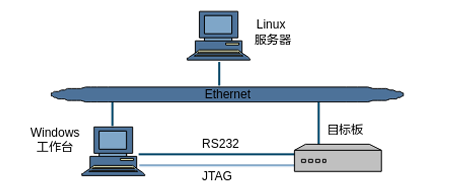

  部署：

  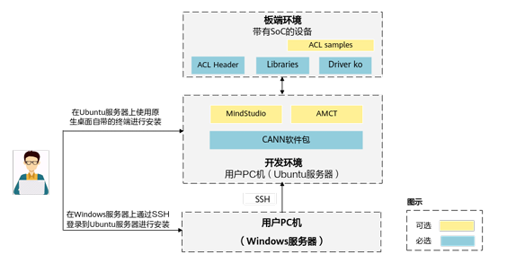

### 软件获取

<font color='RedOrange'>**（注意：以下软件包仅用于教学，未经允许不得转发用于商业用途）**</font>

| 工具名称    | 用途说明                          | 版本要求   | 获取渠道                                                     |
| ----------- | --------------------------------- | ---------- | ------------------------------------------------------------ |
| VirtualBox  | Windows安装Ubuntu系统所需的虚拟机 | 6.1.36版本 | [VirtualBox下载链接](https://download.virtualbox.org/virtualbox/6.1.36/VirtualBox-6.1.36-152435-Win.exe) |
| Ubuntu18.04 | 编译环境所需的Linux系统           | 18.04版本  | [Ubuntu18.04下载链接](https://releases.ubuntu.com/18.04/ubuntu-18.04.6-desktop-amd64.iso) |
| VScode      | 代码阅读和编辑所需的IDE工具       | 1.70.1版本 | [VScode下载链接](https://az764295.vo.msecnd.net/stable/6d9b74a70ca9c7733b29f0456fd8195364076dda/VSCodeUserSetup-x64-1.70.1.exe) |
| MobaXterm   | 终端调试工具                      | V22.1版本  | [MobaXterm下载链接](https://download.mobatek.net/2212022060563542/MobaXterm_Installer_v22.1.zip) |

### 1、PC环境配置

### 1.1、安装VirtualBox虚拟机

- 双击在 **软件获取章节下载** 的VirtualBox-6.1.36-152435-Win.exe 安装包，点击下一步，安装VirtualBox。
- 


- 点击浏览按钮，修改VirtualBox的安装路径，然后点击确定按钮，再点击下一步。


- 当出现下面的界面，点击下一步。


- 当出现下面的界面，点击是。

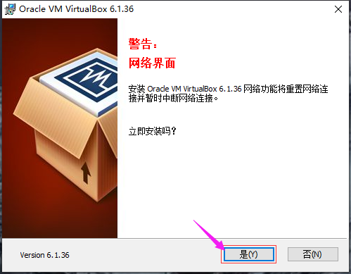

- 当出现下面的安装界面时，点击安装。

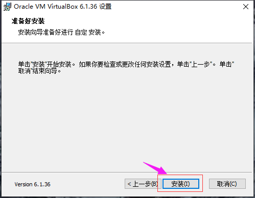

- 点击完成，即可完成VirtualBox的安装。


### 1.2、在VirtualBox中安装Ubuntu18.04

#### 步骤1：导入Ubuntu18.04镜像到VirtualBox

- 打开VirtualBox，点击新建

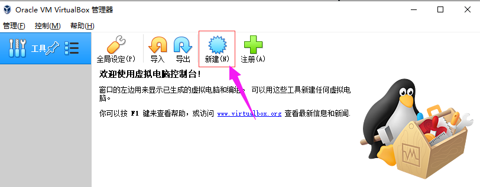

- 修改虚拟机的名称为hispark，然后修改Ubuntu系统的安装文件夹（因为软件默认安装在C盘，我们最好是把安装路径修改为其他磁盘），把类型配置为linux,然后版本选择 Ubuntu(64-bit)，然后再点击下一步。


- 修改Ubuntu的运行内存大小为4G，然后点击下一步。

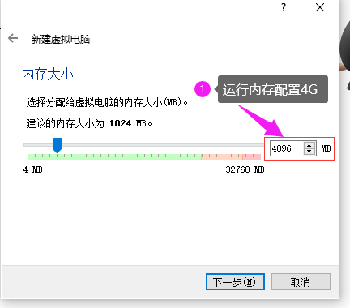

- 选择现在创建虚拟硬盘，然后点击创建按钮。


- 选择VDI（VirtualBox磁盘映像），然后点击下一步。

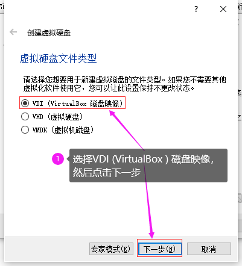

- 选择动态分配，然后点击下一步。

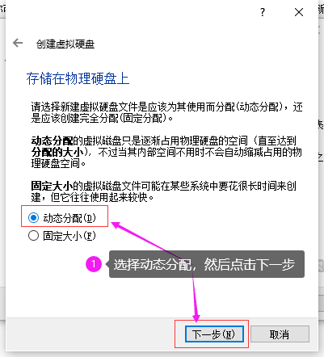

- 修改磁盘空间大小为100GB，然后点击创建按钮。请至少给Ubuntu分配100G的内存空间，否则后面的步骤会因为内存不足出现错误。


- 点击设置按钮，选择常规选项，在高级选项处，把共享粘贴板和拖放都设置为双向，然后点击OK按钮。

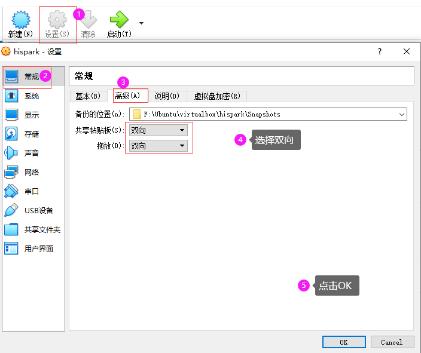

- 点击VirtualBox的设置，然后点击系统，选择处理器，把处理器的数量改为4。
- 注意：如果您的处理器小于等于4个的话，请把处理器数量改小一些。


- 点击网络，选择网卡2，勾选启动网络连接，选择仅主机网络，点击OK。


- 点击设置按钮，选择存储，然后选择没有盘片，点击光盘按钮，点击选择虚拟盘。

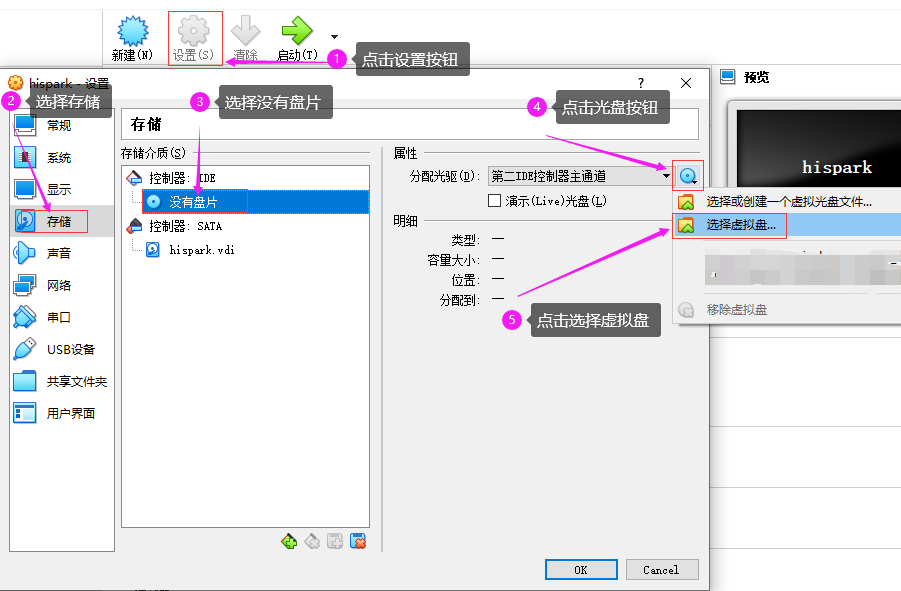

* 选择软件获取章节下载**的Ubuntu18.04的镜像文件，然后点击打开按钮。

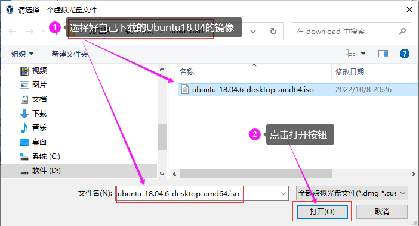

* 然后点击设置的OK按钮。

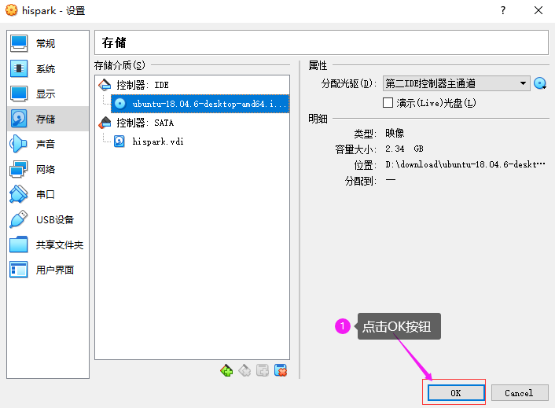

* 选择USB设备，把启动USB控制器的勾选去掉，禁用USB设备，然后点击OK（部分电脑可能无法进行这一步操作，可以先跳过）


* 点击启动，启动Ubuntu系统


#### 步骤2：Ubuntu系统的安装

* 选择中文(简体)，然后点击安装Ubuntu

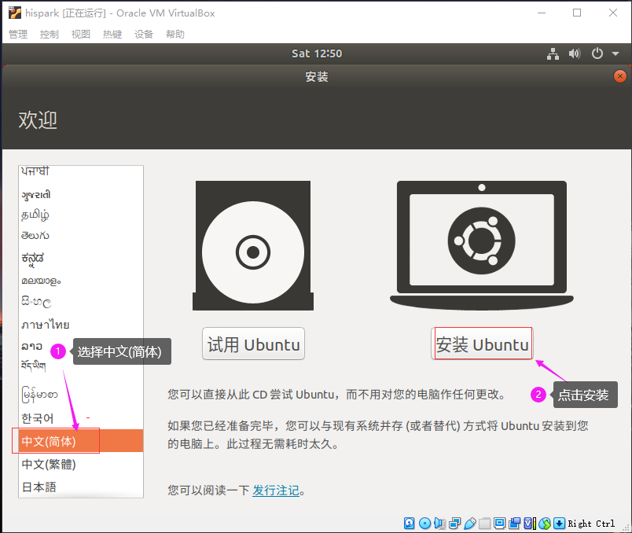

- 如果您安装Ubuntu的时候和我一样，因为分辨率问题，导致界面显示不全，无法看到下面的按钮，您需要按住组合键 ``` Ctrl+Alt+t```打开终端面板，然后输入xrandr，查看一下支持的分辨率。

  

- 我们这边以1920x1200为例，输入 ```xrandr -s 1920x1200``` 后敲回车，修改Ubuntu的分辨率。

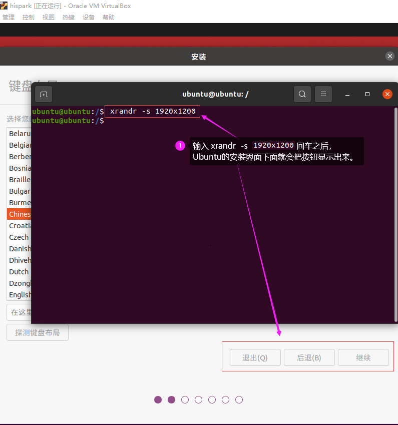

- 选择Chinese，然后点击继续按钮。

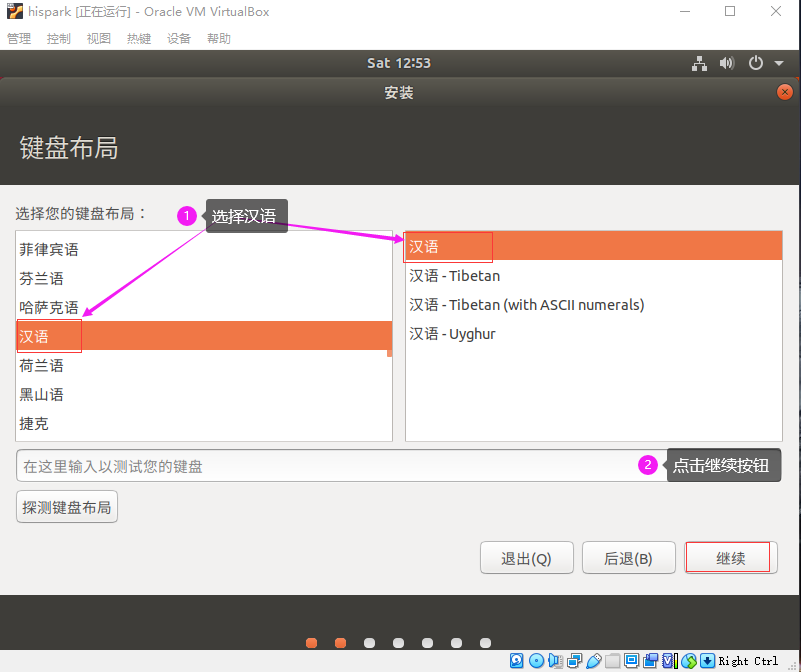

- 将安装Ubuntu时下载更新的勾选去掉，然后点击继续按钮。

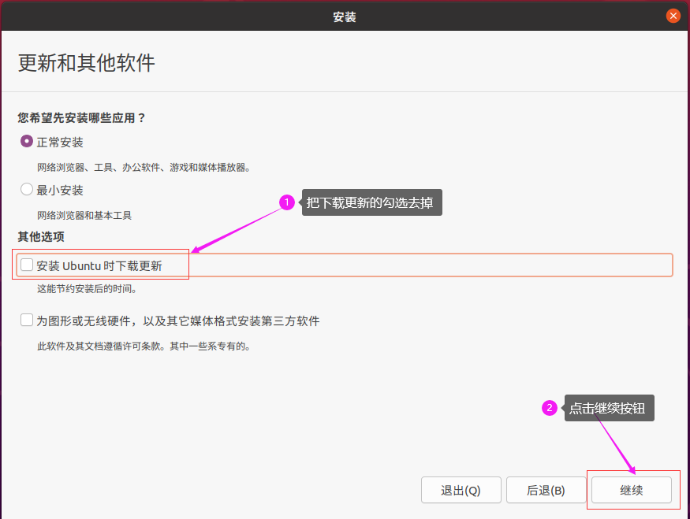

- 点击现在安装。

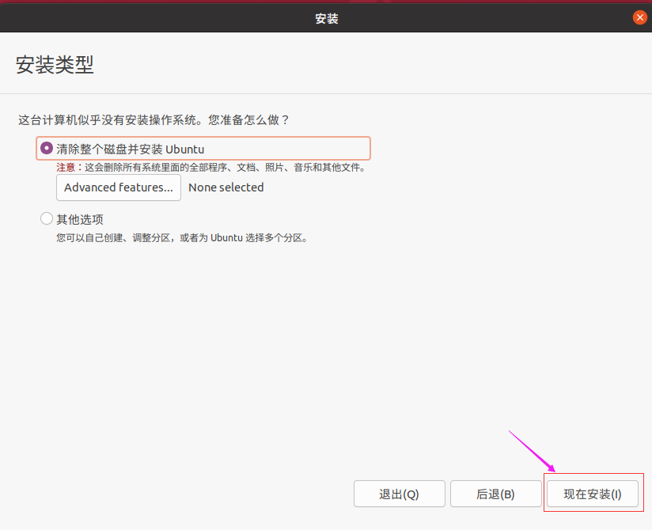

- 点击继续按钮。


- 选择上海，然后点击继续按钮。

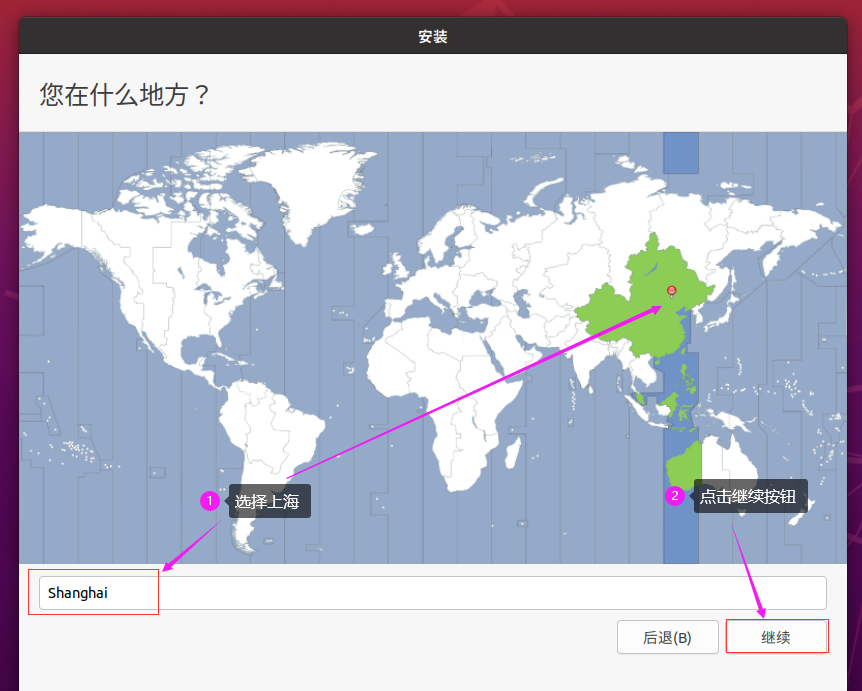

- 设置好账号和密码，点击继续按钮，此处的账号和密码即为您Ubuntu的登录所需的账号和密码。
- 请按照本文的配置来，账号为：hispark，密码为：hispark。

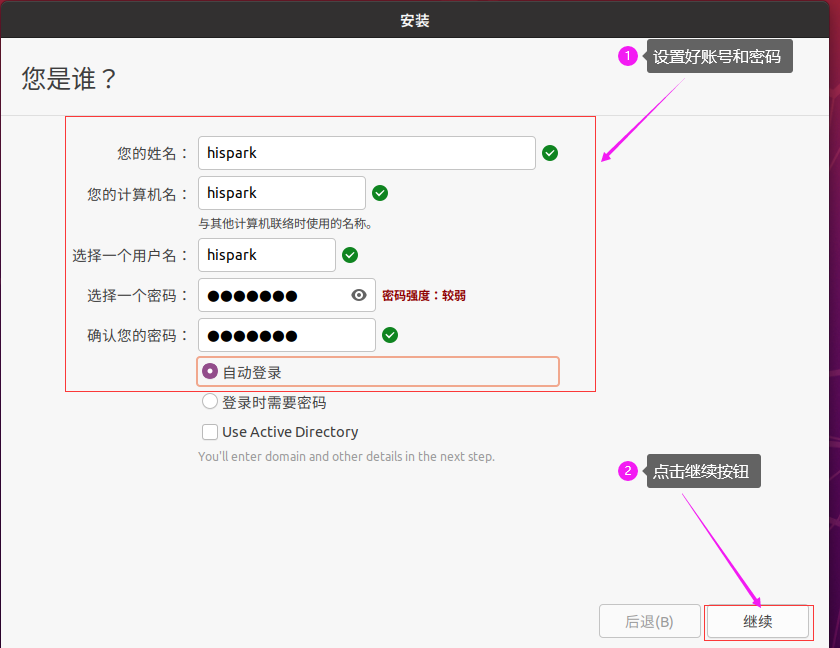

- 开始安装各种软件。


- Ubuntu安装完成后，点击现在重启按钮。


* 如果在重启的过程中出现提示**please remove the installation medium**，可以直接点击关闭按钮，选择强制退出，点击OK即可。


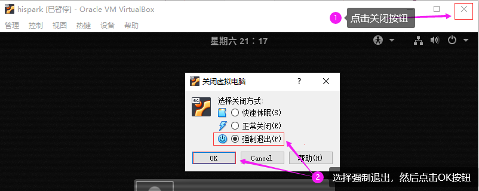

- 当出现此类弹窗，点击前进即可。若Ubuntu弹出是否更新的弹窗，点击不升级即可。我们先暂时不更新。

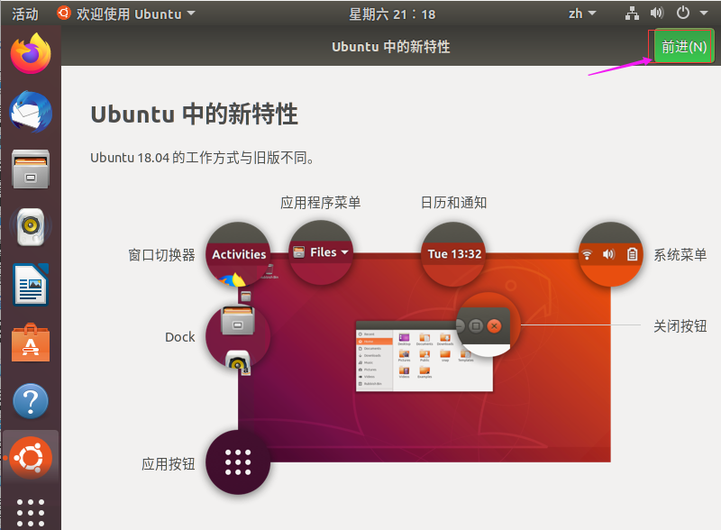

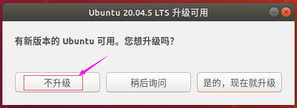

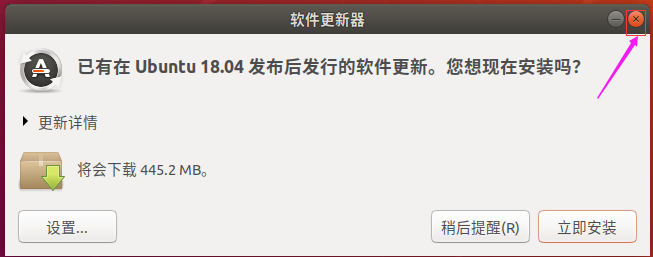

- 点击virtualbox的设备，点击安装增强功能


- 当弹出 弹窗询问是否运行自启动软件时，点击取消。

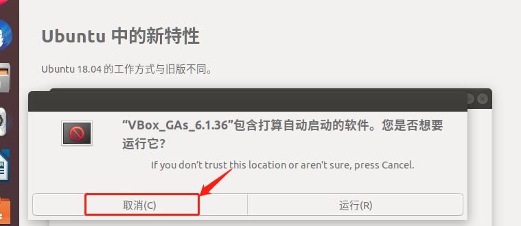

- 此时左边任务栏会多出一个光盘一样的图标，点击并打开光盘图标，进入该文件夹内。

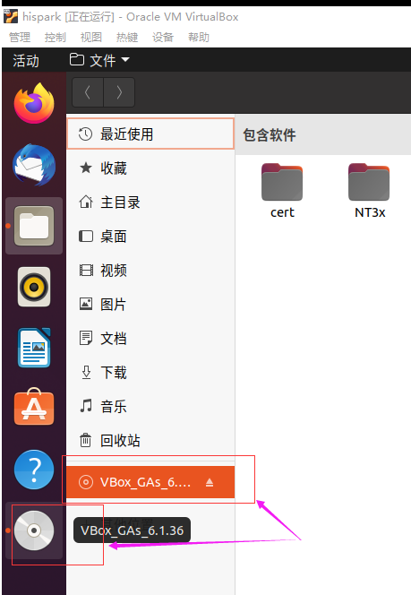

- 在光盘文件夹的空白处，鼠标右键，点击在终端打开。

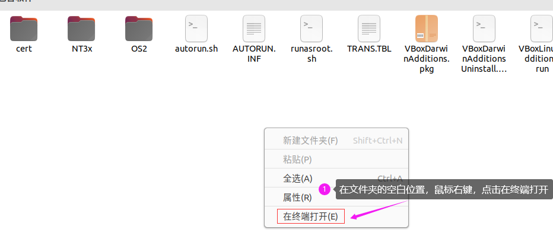

- 执行下面的命令，进行增强功能的安装。

```
sudo apt-get install  gcc make perl -y

sudo ./VBoxLinuxAdditions.run
```


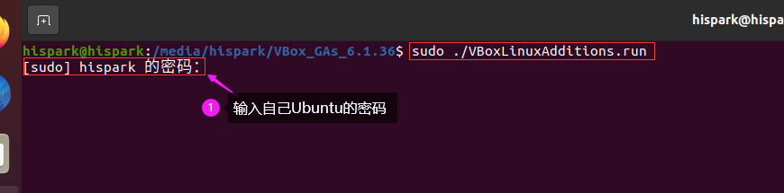

- 安装成功后，在终端执行 reboot命令，重启一下Ubuntu

```
reboot
```

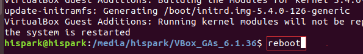

#### 步骤3：更新软件

* 当Ubuntu重启之后，点击Ubuntu桌面左下角九个点图标，然后打开软件和更新图标。


- 点击Ubuntu软件，在**下载自**处点击下拉框，选择其他站点。

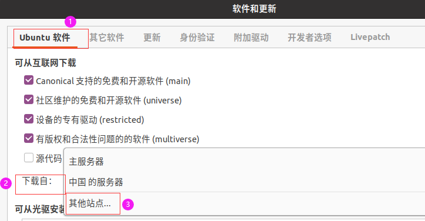

- 在**中国**下方选择**阿里云**，然后点击选择服务器。

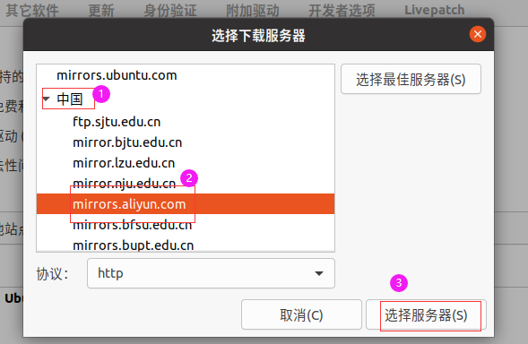

- 此时弹出认证对话框，输入您的Ubuntu登录密码，本文为hispark。


- 点击关闭按钮，然后有对话框时，点击重新载入，此时会有一段时间的软件更新，耐心等待即可。


* 更新完成后，在Ubuntu的桌面，点击鼠标右键，点击在终端打开，打开终端窗口。

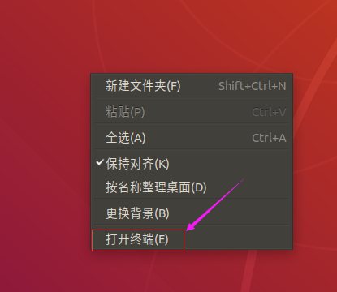

* 在终端输入下面两条命令，进行软件更新

```
sudo apt-get update
sudo apt-get upgrade -y
```


#### 步骤4：配置Ubuntu的SSH服务

* 执行下面的命令，下载SSH-server

```
sudo apt-get install openssh-server -y
```


* 执行下面的命令，启动Ubuntu ssh服务

```
sudo systemctl start ssh
```


#### 步骤5：安装MobaXterm并连接到Ubuntu

* 在Windows 主机，解压在软件获取章节下载** 的MobaXterm_Installer_v22.1.zip 压缩包，然后双击解压后的MobaXterm_installer_22.1.msi，进行MobaXterm的安装。
* 一直点击下一步，即可安装成功。

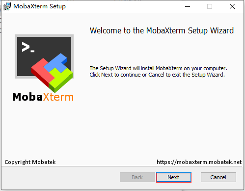

* 执行下面的命令，安装net-tools工具

```
sudo apt install net-tools  -y
```

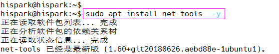

* 执行下面的命令，查看Ubuntu的IP地址，本文Ubuntu的IP地址是 192.168.56.106

```
ifconfig
```

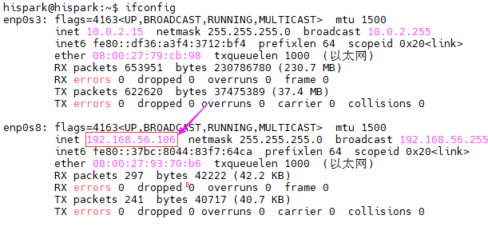

* 打开刚在Windows上安装好的MobaXterm，点击左上角的Session图标，当弹出新的对话框时，点击左上角的SSH图标，然后输入你自己Ubuntu的IP地址，勾选上 Specify username，并填写好你Ubuntu的用户名，点击OK即可。

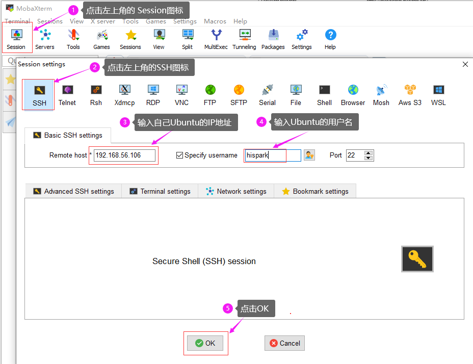

* 点击OK之后，若需要您输入登录密码，直接输入您Ubuntu的用户登录密码即可进入Ubuntu的终端界面。

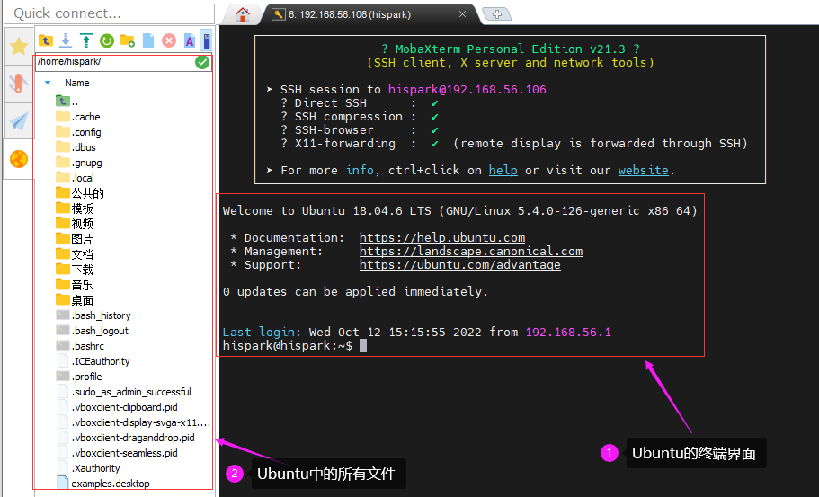

### 2、板端环境配置

#### 步骤1：刷新镜像和KO

按照**驱动和开发环境安装指南**和**SDK安装以及升级使用说明**配置好开发板环境和刷好镜像，加载KO

### 3、配置服务器开发环境

#### 步骤1：按照CANN安装说明安装CANN

- <font color="red">**SS928V100拥有两个图像引擎，它们除却使用的CANN不一样，环境、步骤等都一致；在这里我们称呼SS928V100 SVP_NPU和SS928V100 NPU用于区分它们，请根据需求安装CANN。**</font>
- 在Ubuntu终端执行如下命令，安装Debian软件包。

```shell
sudo apt-get install -y gcc g++ cmake make unzip build-essential zlib1g-dev libbz2-dev libsqlite3-dev libssl-dev libxslt1-dev libffi-dev wget
```

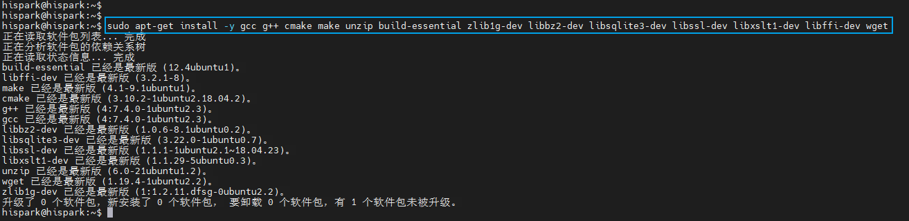

- 在Ubuntu终端执行下面命令，使用wget工具下载Python 3.7.5源码包。

```shell
wget https://www.python.org/ftp/python/3.7.5/Python-3.7.5.tgz
```

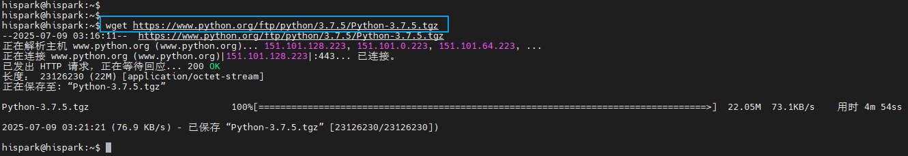

- 下载成功后，在Ubuntu终端执行下面命令，解压源码包。

```shell
tar -zxvf Python-3.7.5.tgz
```

- 在Ubuntu执行下面命令，进入到源码目录中，配置、编译和安装Python 3.7.5。

```shell
#进入源码目录
cd Python-3.7.5

#配置
./configure --prefix=/usr/local/python3.7.5 --enable-loadable-sqlite-extensions --enable-shared

#编译
make

#安装
sudo make install
```

- 安装成功后如下图。

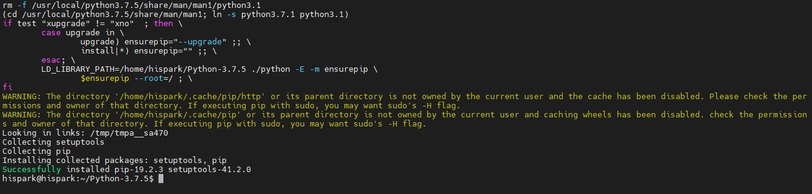

- 在Ubuntu终端执行下面命令，打开.bashrc文件。

```shell
vi ~/.bashrc
```

- 在文件末尾添加Python 3.7.5的环境变量，并保存退出。

```shell
export LD_LIBRARY_PATH=/usr/local/python3.7.5/lib:$LD_LIBRARY_PATH
export PATH=/usr/local/python3.7.5/bin:$PATH
```

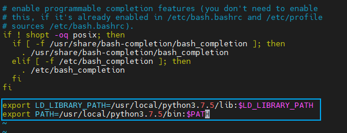

- 在Ubuntu终端执行下面命令，使环境生效并查看python、pip版本。

```shell
#环境生效
source ~/.bashrc

#查看python、pip版本
python3 --version
pip3 --version
```

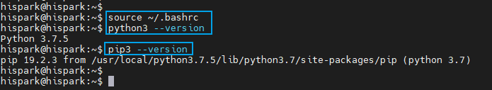

- 在Ubuntu终端执行下面命令，更新pip，避免pip版本过低导致安装失败。

```shell
pip3 install --upgrade pip --user
```

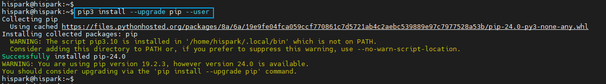

- 在Ubuntu终端执行下面命令，安装python软件包。

```shell
pip3 install wheel protobuf==3.13.0 psutil==5.7.0 numpy>=1.13.3 scipy==1.4.1 decorator==4.4.0 sympy==1.5.1 cffi==1.12.3 pyyaml pathlib2 --user
```

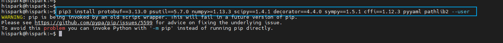

- SS928V100 SVP_NPU和SS928V100 NPU分别对应的CANN软件包为`Ascend-cann-toolkit_6.10.t01spc030b270_linux.x86_64.run`和`Ascend-cann-toolkit_5.20.t6.2.b060_linux-x86_64.run`；**本文展示的是SS928V100 SVP_NPU对应CANN的安装，如果需要安装SS928V100 NPU对应的CANN，更换CANN软件包后按照步骤安装即可**。
- 将CANN软件包拷贝到Ubuntu中，在软件包所在路径的终端执行以下命令，安装CANN。

```shell
#赋予CANN软件包执行权限
chmod +x *.run

#安装CANN软件，请替换以下变量：
#	<path>：CANN指定安装目录
./*.run --install --install-path=<path>
```

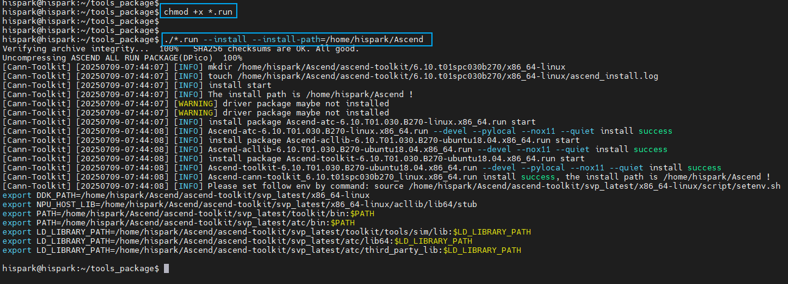

#### 步骤2：搭建交叉编译环境

* SS928V100使用的交叉编译器为`aarch64-mix210-linux`，压缩包名称为`aarch64-mix210-linux.tgz`。

- 将交叉编译器压缩包拷贝至Ubuntu中，在压缩包所在路径的终端执行以下命令，安装交叉编译器。

```shell
#解压并切换目录
tar -xzvf aarch64-mix210-linux.tgz
cd aarch64-mix210-linux

#执行安装脚本
sudo ./aarch64-mix210-linux.install
```

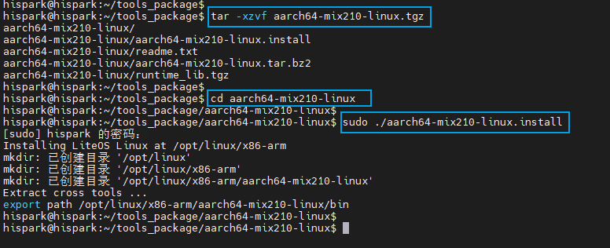

- 在Ubuntu终端执行下面命令，打开.bashrc文件。

```shell
vi ~/.bashrc
```

- 在文件末尾添加交叉编译器的环境变量，保存并退出。

```shell
export PATH="/opt/linux/x86-arm/aarch64-mix210-linux/bin:$PATH"
```

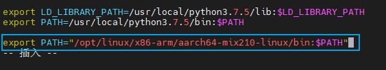

- 在Ubuntu终端执行下面命令，生效环境变量并查看交叉编译器版本。

```shell
source ~/.bashrc && aarch64-mix210-linux-gcc -v
```

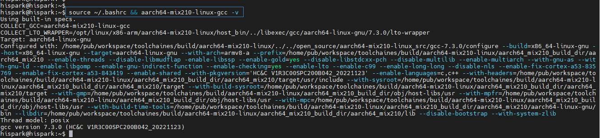


注意：Modelzoo代码编译还需要注意配置环境：

1）linux：./samples/common/cmake/toolchain_aarch64_linux.cmake

2）生态鸿蒙：./samples/common/cmake/toolchain_aarch64_ohos.cmake

#### 步骤3：搭建服务器网络环境

* 先前已经使pc和服务器建立连接，现在需要能和板端建立好连接，**将开发板与PC串口相连，网线直连**

* 进入vituralbox->设置->网络，依次将网卡进行如下设置

  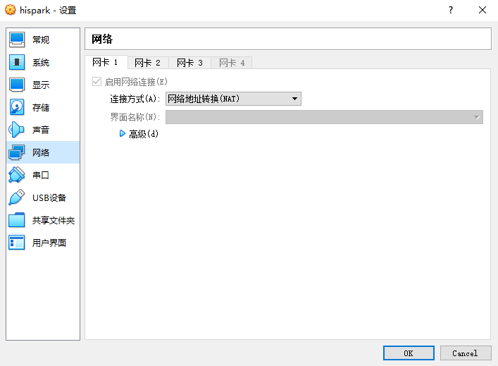

  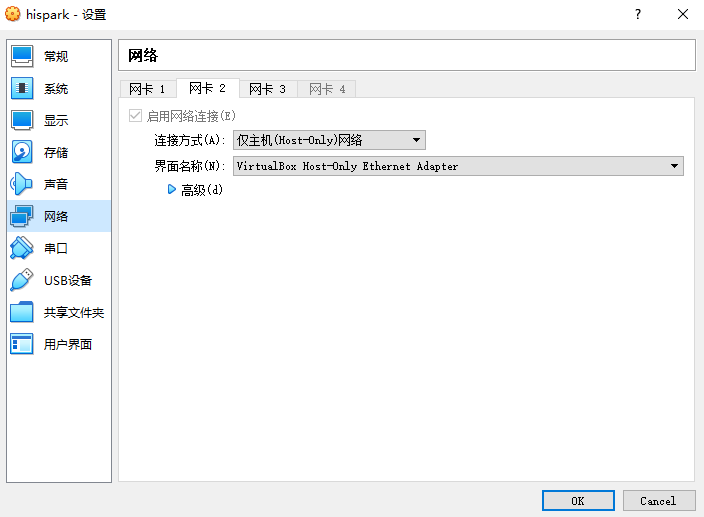

  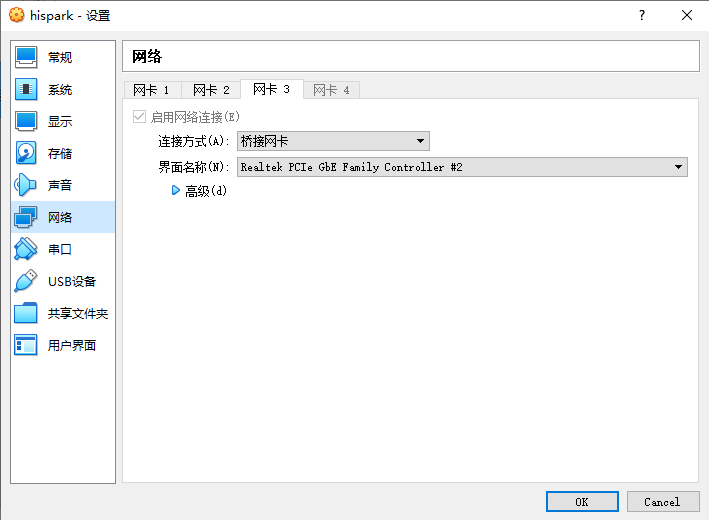

  在网卡3，选择的桥接网卡为在PC端网络适配器中查看到的，与开发板直接相连的网线

  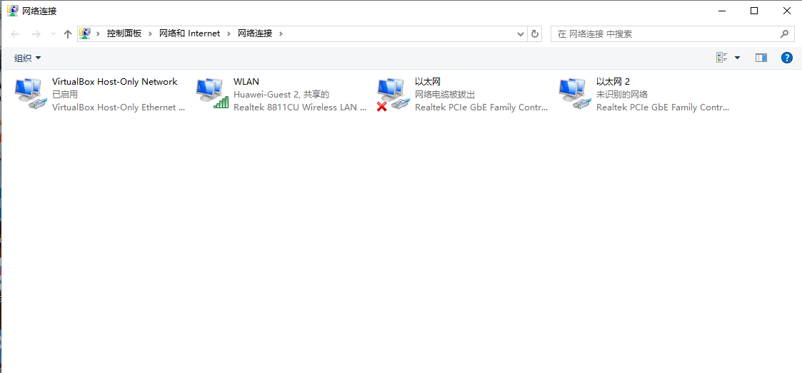

* PC端网络适配器配置，选择virtualbox，右键属性

  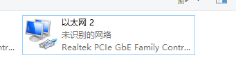

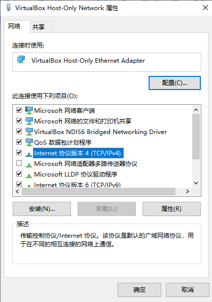

双击版本协议4，配置如下：

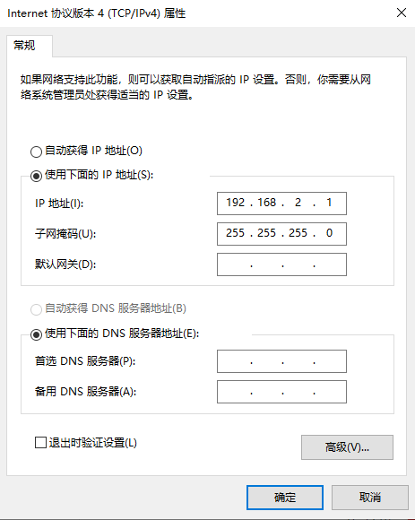

#### 步骤4：配置Ubuntu的ip

* 因为我们在1.2章节的步骤5中，已经能够使用MobaXterm打开Ubuntu的终端，并且能够看到Ubuntu的文件了。现在只需要开发板和板端的ip配置在一个局域网下面就好，在Ubuntu中执行

```
ifconfig
```

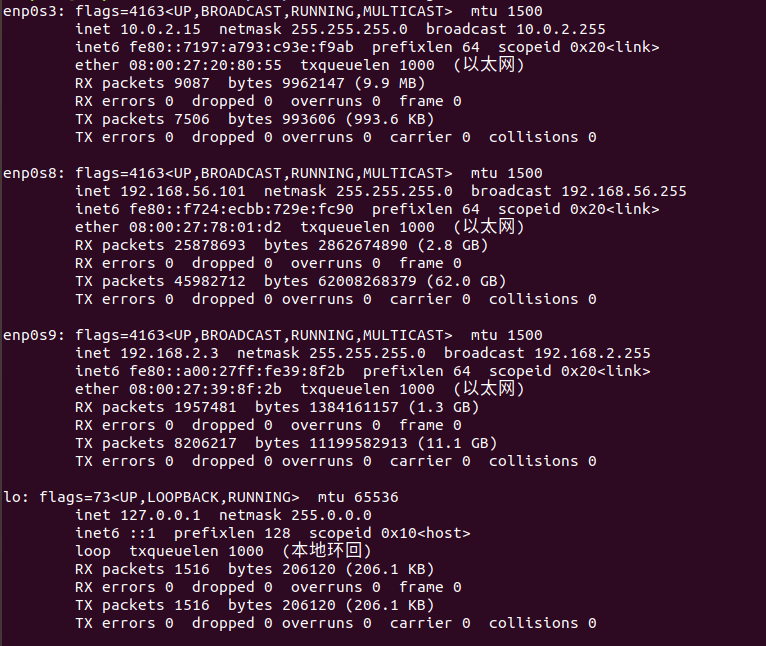

* 可以看到一个enp0s9，这个就是和开发板桥接的网络。

```
cd /etc/netplan
vim 01-network-manager-all.yaml
```

* 写入内容如下

```
network:
  version: 2
  renderer: NetworkManager
  ethernets:
    enp0s9:
      addresses: [192.168.2.3/24]
      dhcp4: no
```

#### 步骤5：更新板端环境

**在开发板中执行**

* ```
  vi /etc/init.d/rcS
  ```

  在末尾加上如下内容：

  ```
  ifconfig eth0 down
  ifconfig eth0 192.168.2.88 netmask 255.255.255.0
  route add default gw 192.168.2.3
  ifconfig eth0 up
  mount -t nfs -o nolock 192.168.2.3:/home/hispark/shared /mnt
  ```

  其中/home/hispark/shared为服务器放置modelzoo代码的位置

  重启开发板

#### 步骤6：ping一下开发板和服务器，正常ping通

#### 步骤7：配置开发板SSH

配置完后，设置ssh密钥

注意开发板上sshd_config配置，AuthorizedKeysFile注意路径配置正确

```
StrictModes no
PubkeyAuthentication yes
PermitRootLogin yes 
AuthorizedKeysFile      ~/.ssh/authorized_keys
```

在服务器上执行

```
ssh-keygen -p -f ~/.ssh/id_rsa
ssh-copy-id -i ~/.ssh/id_rsa.pub root@192.168.2.88
ssh root@192.168.2.88
```

此时应该不需要密码

### 4、安装VSCode

*  如果您电脑上已经安装过VScode，可以跳过此步骤。
*  双击在**软件获取章节下载**的VScode安装包，点击下一步进行安装。


* 点击浏览按钮，选择VScode的安装路径，然后点击下一步。

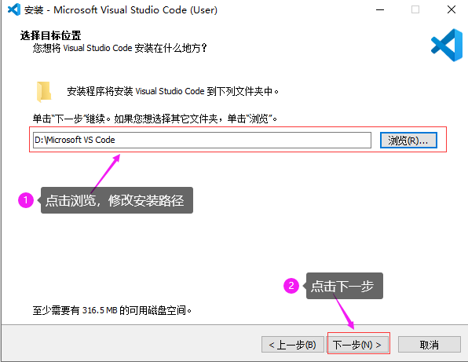

* 出现下方界面，点击下一步。


* 出现下方界面，点击下一步。

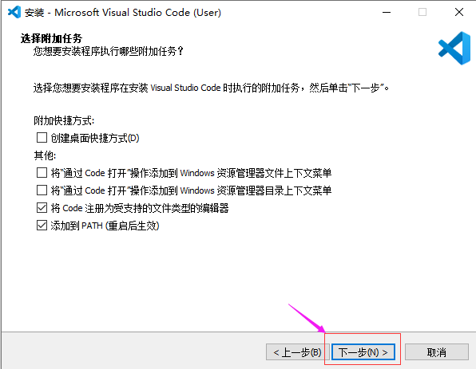

* 出现下方界面，点击安装。


* 出现下方界面，点击完成。


### 5、将modelzoo代码导入到VScode
